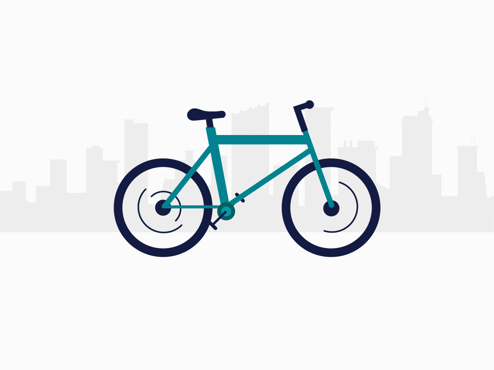

```{r setup, include=FALSE}
options(htmltools.dir.version = FALSE)

db_metrics <- readRDS('../data/db_metrics.rds')

```

# Agenda

<p>&nbsp;</p>

* ## Summary

* ## Historic Metrics

* ## User Behavior 

* ## Conclusion

* ## Next Steps


---
class: inverse, center, middle

# Summary


---

# Summary

<p>&nbsp;</p>

### Let's first take a look at the general numbers!

--

* The data set is from `r db_metrics$min_date` to `r as.Date(db_metrics$max_date)`.

> There is a gap with NO DATA from 2016-09-30 to 2017-04-01!

--

* There were a total of **`r db_metrics$n_trips` trips** in this period.

--

* The average duration of a trip is **`r round(db_metrics$tripduration_avg/60, 0)` minutes**.

> with a stadard deviation equal to **`r round(db_metrics$tripduration_sd/60/60, 0)` hours**!

--

* The maximum duration of a trip was **`r round(db_metrics$tripduration_max/60/60, 0)` hours**.

--

* The minimum duration of a trip was **`r round(db_metrics$tripduration_min/60, 0)` minutes**.


---
class: inverse, center, middle

# Historic Metrics


---

# Historic Metrics - Number of Trips

* Seasonal behavior!

> The number of trips is higher in **Summer** and decreases in **Winter**!

* The number of trips is **increasing over time**!

```{r, eval=TRUE, echo=FALSE, warning=FALSE, error=FALSE, message=FALSE }
require(echarts4r)
require(dplyr)

db_over_time <- readRDS('../data/db_over_time.rds')

db_over_time %>%
  filter(trip_date >= '2011-01-01') %>%
  e_charts(trip_date, height = '70%') %>% 
  e_line(n, legend = FALSE, name = "Number of Trips", color = "#509997", symbol='none') %>%
  e_lm(n ~ trip_date, name = "Linear Progression", color = "#f4d19e", legend = FALSE, symbol='none') %>%
  e_datazoom(type = "slider") %>%
  e_title("Number of Trips Over Time") %>%
  e_tooltip(trigger = "axis") 

```


---

# Historic Metrics - Average Trips Duration

* Outlier detected at 2014-02-13 (average trip of 81 minutes).

* **Seasonal behavior is not as strong**, but in general travel duration in Summer is longer than in Winter.

```{r, eval=TRUE, echo=FALSE, warning=FALSE, error=FALSE, message=FALSE }

db_over_time %>%
  filter(trip_date >= '2011-01-01') %>%
  e_charts(trip_date, height = '70%') %>% 
  e_line(tripduration_avg, legend = FALSE, name = "Average Trip Duration", color = "#761954", symbol='none') %>%
  e_lm(tripduration_avg ~ trip_date, name = "Linear Progression", color = "#f4d19e", legend = FALSE, symbol='none') %>%
  e_datazoom(type = "slider") %>%
  e_title("Average Trip Duration Over Time") %>%
  e_axis_labels(y = "Trip Duration (sec)") %>%
  e_tooltip(trigger = "axis") 

```


---
class: inverse, center, middle

# User Behavior


---

# User Behavior - Hour of the day

* There are **more bike trips at 5pm and 6pm**!

* From midnight to 6am the number of trips is very low!

```{r, eval=TRUE, echo=FALSE, warning=FALSE, error=FALSE, message=FALSE }
db_hour <- readRDS('../data/db_hour.rds')

db_hour %>% 
  filter(!is.na(hour)) %>%
  e_charts(hour) %>%
  e_polar() %>%
  e_angle_axis(hour) %>% 
  e_radius_axis() %>% 
  e_bar(n, coord_system = "polar", legend = FALSE, name = "Number of Trips", color = "#509997") %>%
  e_title("Number of Trips by Hour") %>%
  e_tooltip(trigger = "axis") 
```


---

# User Behavior - Day of the week

* There are **more bike rides** on **Thursdays** and **Tuesdays**, but the duration of trips on these days is not long.

* **Saturday** and **Sunday** presented **more long trips duration** in average.

> As the number of bikes are the same and, the trips are longer during the weekend that possible explains the low number of rides on Saturday and Sunday!

```{r, eval=TRUE, echo=FALSE, warning=FALSE, error=FALSE, message=FALSE }
db_week <- readRDS('../data/db_week.rds')

 db_week %>%
  e_charts(week_day, height = '60%') %>%
  e_bar(n, name = "Number of Trips", color = "#509997") %>%
  e_bar(tripduration_avg, name = "Average Trip Duration", color = "#761954", x_index = 1, y_index = 1) %>%
  e_grid(height = "27%") %>% 
  e_grid(height = "27%", top = "50%") %>% 
  e_y_axis(gridIndex = 1) %>% 
  e_x_axis(gridIndex = 1) %>%
  e_title("Trips by Weekday") %>%
  e_tooltip(trigger = "axis") %>%
  e_legend(right = 0)

```


---

# User Behavior - Gender

* **Men** presented **more bike rides** than Women, but the **duration of trips are longer for Women**.


```{r, eval=TRUE, echo=FALSE, warning=FALSE, error=FALSE, message=FALSE }
db_gender <- readRDS('../data/db_gender.rds')

db_gender <- db_gender %>%
  filter(gender != "")

db_gender %>%
  e_charts(gender) %>%
  e_bar(n, name = "Number of Trips", color = "#509997") %>%
  e_bar(tripduration_avg, name = "Average Trip Duration", color = "#761954", x_index = 1, y_index = 1) %>%
  e_grid(height = "35%") %>% 
  e_grid(height = "35%", top = "50%") %>% 
  e_y_axis(gridIndex = 1) %>% 
  e_x_axis(gridIndex = 1) %>%
  e_title("Trips by Gender") %>%
  e_tooltip(trigger = "axis") %>%
  e_legend(right = 0)

```


---

# User Behavior - User Type

> Customer: User with 24 hour pass or 7 day pass.

> Subscriber: Annual membership.

* **"Subscribers"** presented **more bike rides** than "Customers", but the **duration of trips are longer for "Customers"**.

```{r, eval=TRUE, echo=FALSE, warning=FALSE, error=FALSE, message=FALSE }
db_usertype <- readRDS('../data/db_usertype.rds')

db_usertype <- db_usertype %>%
  filter(usertype != "")

db_usertype %>%
  e_charts(usertype, height = '70%') %>%
  e_bar(n, name = "Number of Trips", color = "#509997") %>%
  e_bar(tripduration_avg, name = "Average Trip Duration", color = "#761954", x_index = 1, y_index = 1) %>%
  e_grid(height = "30%") %>% 
  e_grid(height = "30%", top = "50%") %>% 
  e_y_axis(gridIndex = 1) %>% 
  e_x_axis(gridIndex = 1) %>%
  e_title("Trips by User Type") %>%
  e_tooltip(trigger = "axis") %>%
  e_legend(right = 0)

```


---

# User Behavior - Age

* There are some **errors in the register of the birth year** (users with more than 100 years old).

> These errors could represent fraud or problems during the registration process.

> It was removed the users with ages higher than 70 years old.

* From 16 to 30 years old, the older the more bike rides.

* From 31 to 70 years old, the older the fewer bike rides.

```{r, eval=TRUE, echo=FALSE, warning=FALSE, error=FALSE, message=FALSE }
db_age <- readRDS('../data/db_age.rds')

db_age <- db_age %>%
  filter(!is.na(age))

db_age %>%
  filter(age <= 70) %>%
  mutate(tripduration_avg = round(tripduration_avg, 1)) %>%
  e_charts(age, height = '55%') %>% 
  e_scatter(n, legend = FALSE, color = "#761954", size = tripduration_avg) %>%
  e_title("Number of Trips by Age") %>%
  e_axis_labels(y = "Trip Duration (seconds)", x = "Age (years)") %>%
  e_tooltip(
    trigger = "axis"
    # formatter = htmlwidgets::JS("
    #   function(params){
    #     return(
    #     '<b>Age</b>: ' + params.value[0] + ' years old' +
    #     '<br /><b>Number of Trips</b>: ' + params.value[1] +
    #     '<br /><b>Average Trip Duration</b>: ' + params.value[2]
    #     )
    #   }
    # ")
    ) 

```


---

# User Behavior - Popular Routes

* The most frequent routes are a circle (same start and end point).

> The most frequent routes are around **tourist attractions**!

```{r, eval=TRUE, echo=FALSE, warning=FALSE, error=FALSE, message=FALSE }
require(leaflet)

# trips popular routes
db_routes <- readRDS('../data/db_routes.rds')

# create leaflet icon
bike_job_start <- makeIcon(
  iconUrl = "../img/bike_job_start.png",
  iconWidth = 75, 
  iconHeight = 50
)

bike_job_end <- makeIcon(
  iconUrl = "../img/bike_job_end.png",
  iconWidth = 74, 
  iconHeight = 50
)

bike_tour <- makeIcon(
  iconUrl = "../img/bike_tour.png",
  iconWidth = 75, 
  iconHeight = 50
)


db_routes_tour <- db_routes[1:4,]

db_routes_urban <- db_routes[5,]


# create map
leaftlet_map <- leaflet(db_routes_tour, width = "100%", height = "50%") %>% 
  addTiles() %>%
  addMarkers(
    lat = ~db_routes_tour$start_station_latitude, 
    lng = ~db_routes_tour$start_station_longitude, 
    popup = 'Circle Touristic Routes',
    icon = bike_tour) %>%
  addMarkers(
    lat = ~db_routes_urban$start_station_latitude, 
    lng = ~db_routes_urban$start_station_longitude, 
    popup = 'Urban Routes Start',
    icon = bike_job_start) %>%
  addMarkers(
    lat = ~db_routes_urban$end_station_latitude, 
    lng = ~db_routes_urban$end_station_longitude, 
    popup = 'Urban Routes End',
    icon = bike_job_end) %>%
  addPolylines(
    lat = ~c(db_routes_urban$start_station_latitude,db_routes_urban$end_station_latitude),
    lng = ~c(db_routes_urban$start_station_longitude, db_routes_urban$end_station_longitude),
    stroke = TRUE,
    opacity = 1,
    weight = 5,
    color = 'black',
    dashArray =  '10, 10',
    popup = ~paste(round(db_routes_urban$tripduration_avg/60, 2), "minutes")
  ) 
leaftlet_map

```

<span style="color:purple"><b>Purple</b></span> icons indicates circle Touristic Routes.

<span style="color:green"><b>Green</b></span> icons indicates the start point of the route.

<span style="color:red"><b>Red</b></span> icons indicates the end point of the route.


---
class: inverse, center, middle

# Conclusions


---

# Conclusions

* The number of trips is increasing over time.

* The number of trips is higher in Summer and decreases in Winter.

* There are more bike trips at 5pm and 6pm.

* Saturday and Sunday presented more long trips duration in average.

* Men presented more bike rides than Women, but the duration of trips are longer for Women.

* "Subscribers" presented more bike rides than "Customers", but the duration of trips are longer for "Customers".

* From 16 to 30 years old, the older the more bike rides.

* From 31 to 70 years old, the older the fewer bike rides.

* The most frequent routes are around tourist attractions.

---
class: inverse, center, middle

# Next Steps


---

# Next Steps

* Forecast model to predict the increase in the number of trips.

* Cluster model to understand the different groups of users.

> Different plans for differnt users!

* **More bikes on tourist attractions (mainly during the Summer weekends)!**
.center[
  
]


---
class: center, middle

<span style="font-size:30px"><b>Thanks!</b></span>

<p>&nbsp;</p>

The codes are available on [**GitHub**](https://github.com/adsoncostanzifilho/citi_bikes).

